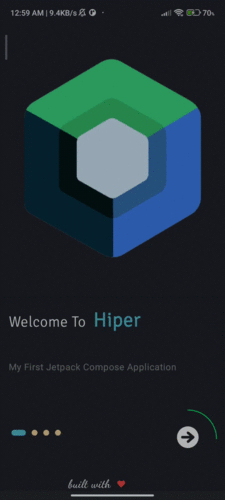
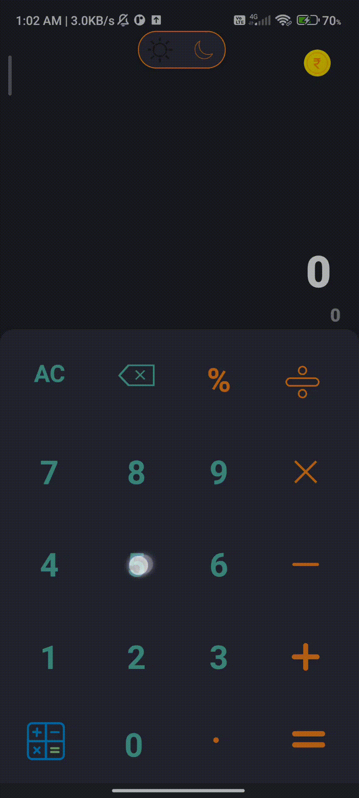
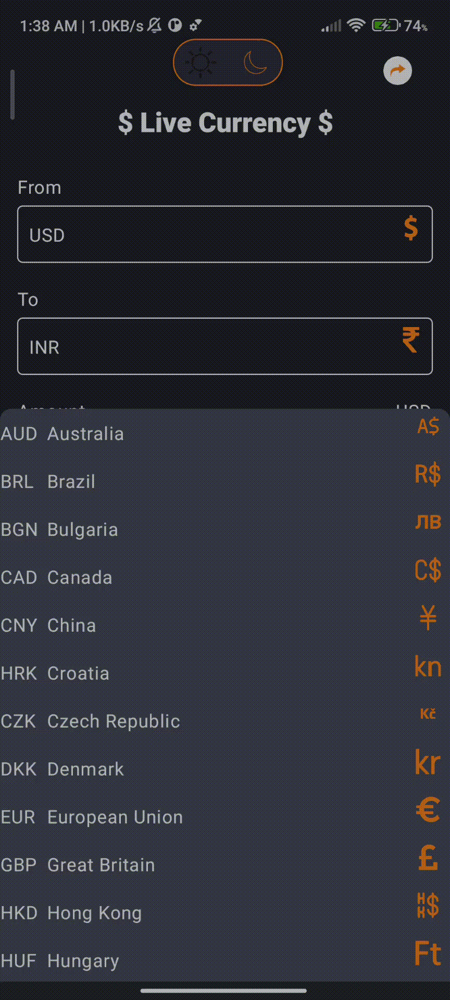
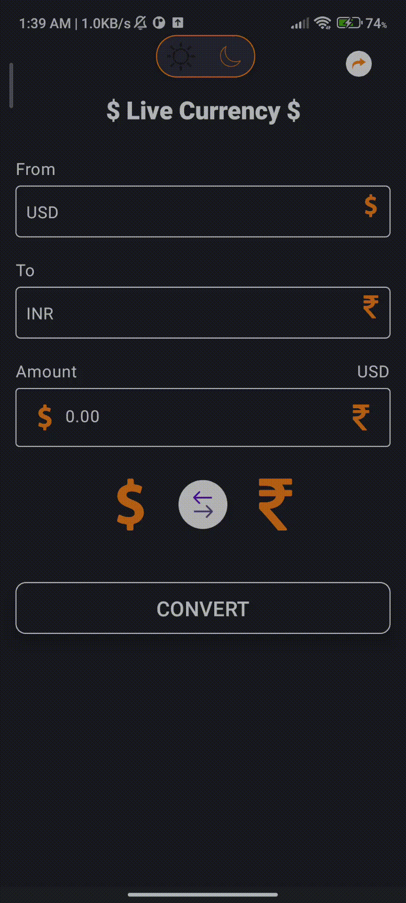

# 📱Hiper 💱

Simple Minimialistic Calculator with Currency Converter

## Description

Hiper is a simple Minimialisic Calculator with Currency Converter.
It has Simple smooth Animations completely based on Jetpack Compose.

I bet u will love the UI. ❤️

## Features

- 🌓 Light/dark mode as per Device Theme
-  ⏭️ Beautiful Onboarding Screen
- 💹 Live Currency Converter
- 💖 Beautiful Lottie Animations 
- 🔑 History of Calculations
- 🎯 Live Calculations
- ⁉️ No internet Animations (inspired by Amazon)
- 🥇 Animated Splash Screen

## FAQ

####  1. Does App support Light Dark toggle ?

No!! It Uses System by Default. 

#### 2. Does Animations make App hevay ?

Using JSON format makes animations much cleaner.

#### 3. Does Currency Converter work Offline

As it fetches live API, device needs to be online.

## 🛠 Notable Dependancies Used
 - Jetpack Compose 
 - Dagger Hilt 
 - Retrofit
 - Shared Preferences
 - Gson Converter
 - Lottie JSON
 - Kotlin Coroutines
 - Splash Screen API
 - Pager API
 - Material Theme 3
 - View Model for Compose
 

## Live ScreenShots : (Optimized to be viewed on Phone Screens Only !!)
Please Wait till Gif is loading :)

#### Beautiful Onboarding Screen !!

#### Hiper Calculator (Observer Minimialistic Animations) !!

#### Live Currency Converter !!

#### Light or Dark Theme 😉 !!

#### My fav 💖 No Internet Animation !!

## Optimizations

What optimizations did you make in your code? E.g. refactors, performance improvements, accessibility

## Acknowledgements

 - [Kotlin docs](https://kotlinlang.org/)
 - [Developer Docs](https://developer.android.com/)
 

## Authors

- [@thekaailashsharma](https://www.github.com/thekaailashsharma)

